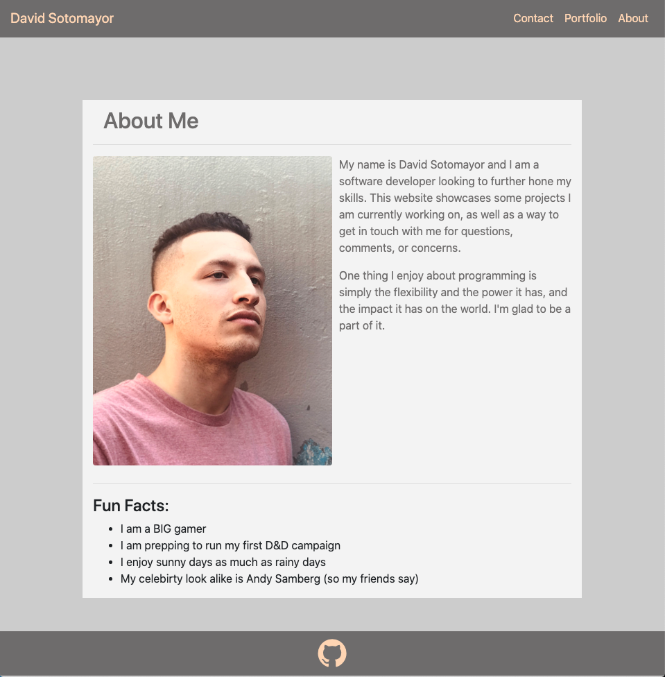

# Responsive Portfolio

This repository houses my personal portfolio website.  In it, you should be able to browse through:
* An 'About Me' page which shares some info about me
* My portfolio which showcases all my projects
* A contact page where you can get in touch with me

### Preview

Here is a small preview of my website...

### Appreciation

I would like to thank you for visiting my repository and my website.  If there are any questions or comments, please feel free to reach out to me.  If you have not already, visit my website: [David's Website](https://davidesotomayor.github.io/)

#### Source:

This website was made exclusively on the [Bootstrap](https://getbootstrap.com/) framework.  I would recommend this framework to anyone looking to start creating their own website.

#### License:

**Copyright (c) David Sotomayor**

Licensed under the [MIT](https://github.com/microsoft/vscode/blob/master/LICENSE.txt) license.